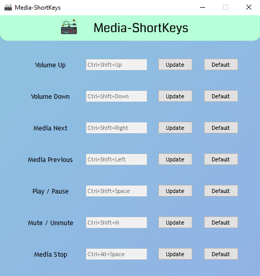

# Media-ShortKeys 

[](https://github.com/CheapNightbot/Media-ShortKeys/stargazers)
[](https://github.com/CheapNightbot/Media-ShortKeys/blob/main/LICENSE)
[]()

<B>POV</B>: Your keyboard doesn't have [Media keys](https://wiki.jriver.com/index.php/Keyboard_Media_Keys)...

> __NEVER DOWNLOAD / RUN ANY EXECUTABLE (.EXE) FILE FROM THE INTERNET IF YOU DON'T TRUST THE SOURCE!__
>> But me have created executable if you don't wanna do it using `pyinstaller` package. You can check the source code.

### Todo list ~~〒▽〒~~ ヾ(￣▽￣) Done-dana-done
- [x] Create a GUI for Media-ShortKeys.
- [x] Can set / change custom key combinations through GUI.
- ~~[ ] Maybe add abbreviation feature through GUI.~~
- [x] Update [Releases](https://github.com/CheapNightbot/Media-ShortKeys/releases) to the latest v2.0.1

### Why you need this?
- Many keyboard comes with Media Keys, which can control any media playing on your device (like; play/pause & volume up/down) and it's Kool...
- <B>Best example</B>; you are listening to Spotify and you can't change track or simply play/pause songs without being focused to Spotify app window without Media Keys. Spotify shortcuts like 'Ctrl + Right Arrow' doesn't work if you are not focused to Spotify (or app is in system tray).

<p align="center">  </p>

# Feature
> Tested on Windows 10 Pro (64-bit)<br>I'm not sure about any other Operating System.
- Basiclly it simulates *Media Keys* on keyboard (but if you want you can do anything xD).
- Control any media playing on your device by:
    - Play / Pause: ``Ctrl + Shift + Space``
    - Volume Up: ``Ctrl + Shift + Up Arrow``
    - Volume Down: ``Ctrl + Shift + Down Arrow``
    - Mute / Unmute: ``Ctrl + Shift + M``
    - Next: ``Ctrl + Shift + Right Arrow``
    - Previous: ``Ctrl + Shift + Left Arrow``
    - Stop: ``Ctrl + Alt + Space``

- You can add any key combinations you like. "Default" button to set key combination(s) to default.

- It can be minimized to the system tray and when focused to the GUI, you can press `Ctrl+Q` to close the application.

# Requirements
> <B>NOTE:</B> If you don't want to install all the packages and stuff, check [releases](https://github.com/CheapNightbot/Media-ShortKeys/releases/tag/v2.0.1). Download and extract .rar file anywhere you like (e.g. C:\Program Files) and just run the `Media-ShortKeys.exe`.

Make sure to install following packages (`pyinstaller` is optional. Only install it if you are going to make executable):

[](https://pypi.org/project/keyboard/)
[](https://pypi.org/project/PySide2/)
[](https://pypi.org/project/pyinstaller/)
    
# Make executable using `pyinstaller`

You can simply run following command in terminal:
```
pyinstaller -n "Media-ShortKeys" --noconsole --icon="assets\keyboard.ico" --add-data="assets;assets" --upx-dir="UPX_DIRECTORY_PATH" --clean app.py
```
- ``-n "App_Name"`` for naming your .exe file.
- ``--noconsole`` to disable console window.
- ``--icon=your_icon.ico`` will set the icon of application. You can add any image as icon, but make sure it's an `.ico` file.
- ``--add-data="assets;assets"`` will add "assets" folder containing icon, images, etc. into your application executable folder (basically copy-paste). Without it, you will not be able to see application icon and GUI images when it will run.
- ``--upx-dir="UPX_DIRECTORY_PATH"`` will compress (reduce) the size of our application. Just [download UPX](https://github.com/upx/upx/releases/tag/v4.0.2), extract it anywhere and copy it's path to this. ([UPX](https://upx.github.io/) is a free utility for compressing executable files and libraries).
- ``--clean`` for cleaning PyInstaller cache and remove temporary files before building.
- ``app.py`` is our python file name.

>  For detailed information, please refer to [Pyinstaller Official Documantation](https://pyinstaller.org/en/stable/)
